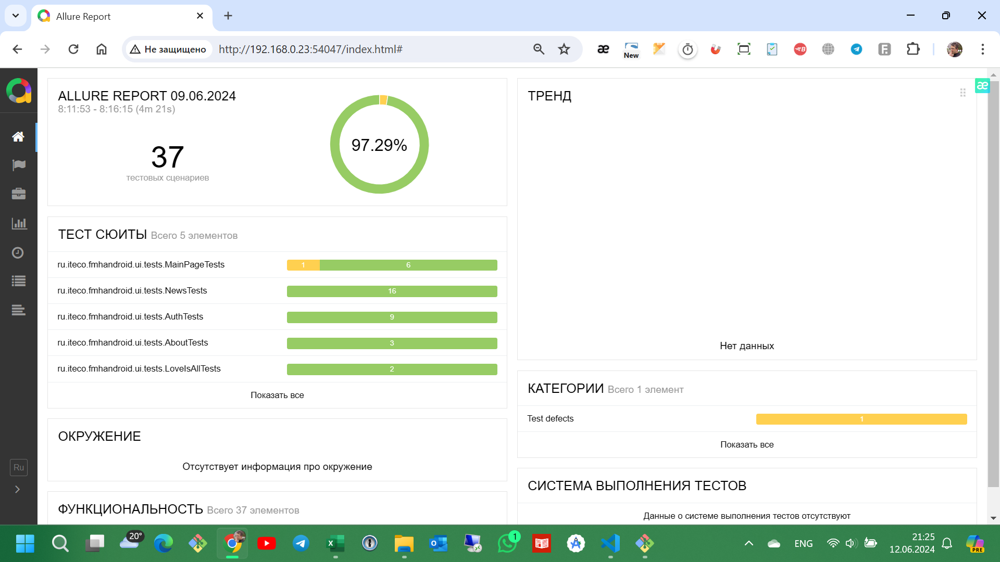

# Отчет о тестировании

## Общее количество тест-кейсов по видам тестирования

- Ручное тестирование - 39 тестов.
- Автоматизированное тестирование - 37 тестов.

## Результаты сравнения времени проверки приложения с помощью ручного и автоматизированного тестирования:

- Разработка чек-листа и тест-кейсов: 35 часов.
- Ручное тестирование: 6 часов.
- Разработка проекта и написание автотестов: 65 часов.
- Выполнение автотестов: 5 минут.

Подробные результаты автотестирования приведены в Allure Report, из 37 тестов 36 пройдены успешно.

